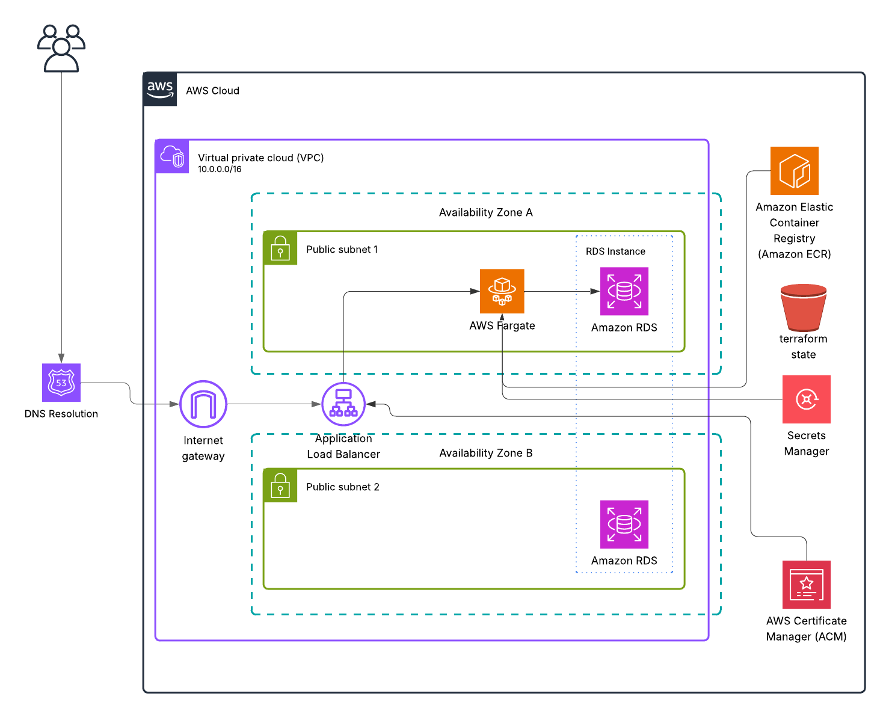
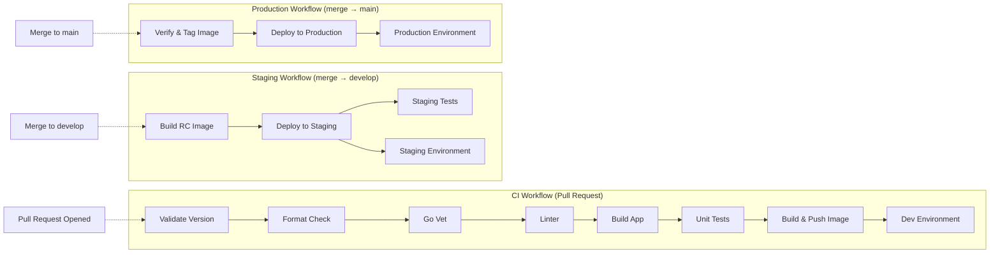

# Architecture Overview

## System Architecture

## Component Description

### Client Layer
- **API Client**: Any HTTP client that can make REST API calls
- **CLI Tools**: Command-line interface for automation
- **SDK/Client Libraries**: Language-specific client libraries
- **Authentication**: Uses API key via X-API-Key header

### Load Balancer
- **Application Load Balancer (ALB)**
  - SSL/TLS termination via ACM
  - Health checks with configurable thresholds
  - Request routing with path-based rules
  - Security groups with least privilege
  - WAF integration for DDoS protection (Not demonstrated)

### Application Layer
- **ECS Container**
  - Go application with optimized runtime
  - Environment configuration via Secrets Manager
  - Health monitoring with CloudWatch
  - Auto-scaling based on metrics (Not needed, not demonstrated for this)
  - Container insights for performance

### Database Layer
- **RDS PostgreSQL**
  - Managed database service with automated maintenance
  - Automated backups with point-in-time recovery
  - High availability with multi-AZ deployment
  - Security groups with encrypted connections
  - Performance insights and monitoring

### Supporting Services
- **ECR**: Container registry with image scanning
- **S3**: Terraform state storage with versioning
- **Secrets Manager**: Secure credential storage with rotation
- **CloudWatch**: Centralized logging and monitoring
- **ACM**: SSL certificate management

## Deployment Architecture

## Data Flow

1. Client sends authenticated request to ALB
2. ALB performs SSL termination and WAF checks
3. Request is routed to healthy ECS container
4. Application validates API key and request
5. Database operations performed with connection pooling
6. Response is logged and metrics are recorded
7. Response returned to client with appropriate headers

## High Availability

- Multi-AZ RDS deployment with automated failover
- ECS container redundancy across AZs
- ALB health checks with configurable thresholds
- Automated failover with zero downtime
- Read replicas for database scaling
- Connection pooling for efficient resource usage

## Disaster Recovery

- Automated database backups with point-in-time recovery (not demonstrated for costs)
- Terraform state versioning in S3
- Container image versioning in ECR
- Infrastructure as Code with modular design
- Cross-region replication for critical data
- Automated recovery procedures

## Scaling

- Horizontal scaling via ECS with auto-scaling groups
- Connection pooling for efficient resource usage
- Load balancing with health checks
- Resource-based auto-scaling policies

## Cost Optimization

- Spot instances for non-critical workloads
- Auto-scaling based on demand
- Resource tagging for cost allocation
- CloudWatch cost monitoring